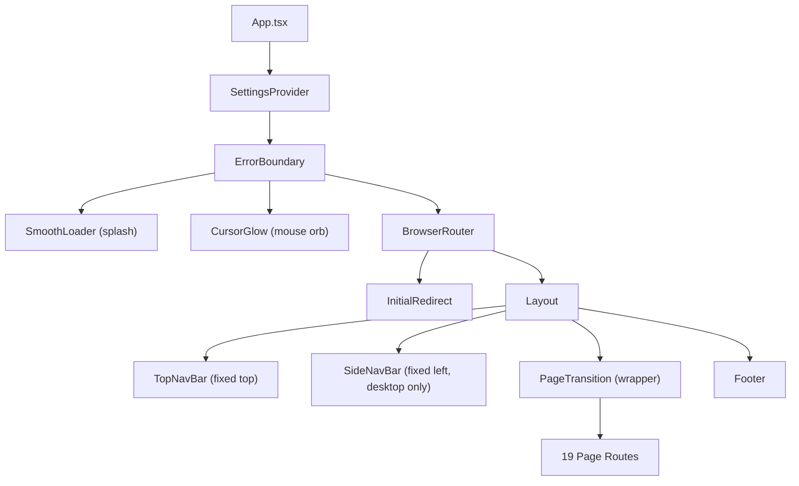
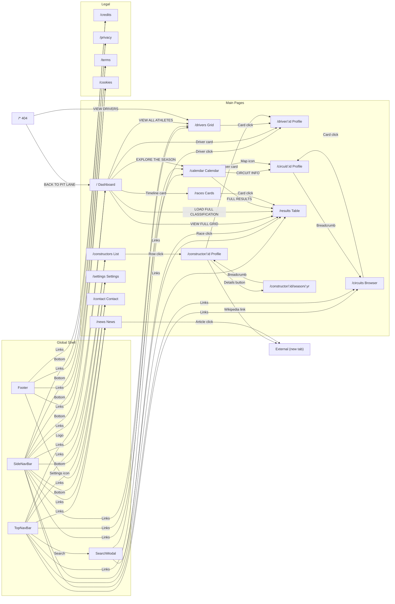

# F1 Stats — Frontend Developer Guide

> A complete reference for every button, action, interactive element, feature, and page-to-page connection in the F1 Stats application.

---

## Application Shell & Global Components

Before any page renders, the user interacts with a persistent shell made up of **4 always-present components**:

---

### 1. TopNavBar (Fixed Header — All Pages)

[TopNavBar.tsx](file:///c:/Users/VICTUS/Projects/demo/src/components/layout/TopNavBar.tsx)

| Element | Type | Action | Visible On |
|---|---|---|---|
| **☰ Hamburger Menu** | `<button>` | Toggles `mobileMenuOpen` state → shows/hides full-screen mobile nav overlay | Mobile only (`md:hidden`) |
| **"F1 STATS" Logo** | `<Link to="/">` | Navigates to Dashboard (`/`) | Always |
| **News** | `<Link to="/news">` | Navigates to News page | Desktop nav (`hidden md:flex`) |
| **Calendar** | `<Link to="/calendar">` | Navigates to Season Calendar | Desktop nav |
| **Circuits** | `<Link to="/circuits">` | Navigates to Circuits page | Desktop nav |
| **Drivers** | `<Link to="/drivers">` | Navigates to Drivers page | Desktop nav |
| **Results** | `<Link to="/results">` | Navigates to Results page | Desktop nav |
| **Constructors** | `<Link to="/constructors">` | Navigates to Constructors page | Desktop nav |
| **🔍 Search icon + `⌘K` badge** | `<button>` | Sets `searchOpen = true` → renders `<SearchModal>` | Always |
| **⚙️ Settings icon** | `<Link to="/settings">` | Navigates to Settings page | Always |

**Keyboard Shortcut:** `Ctrl+K` / `⌘K` → Opens the SearchModal globally.

**Scroll Behavior:** After scrolling 40px, the header gains stronger background opacity + shadow via `scrolled` state.

**Mobile Menu Overlay** (when `mobileMenuOpen === true`):

| Element | Action |
|---|---|
| Dashboard (icon: `dashboard`) | → `/` |
| News (icon: `newspaper`) | → `/news` |
| Calendar (icon: `calendar_month`) | → `/calendar` |
| Circuits (icon: `map`) | → `/circuits` |
| Standings (icon: `leaderboard`) | → `/drivers` |
| Archives (icon: `history`) | → `/results` |
| Constructors (icon: `groups`) | → `/constructors` |
| Settings (icon: `settings`) | → `/settings` |

The mobile menu **auto-closes on route change** via the `useEffect` watching `pathname`.

---

### 2. SideNavBar (Fixed Left Sidebar — Desktop Only ≥1024px)

[SideNavBar.tsx](file:///c:/Users/VICTUS/Projects/demo/src/components/layout/SideNavBar.tsx)

| Element | Icon | Action | Active Highlight |
|---|---|---|---|
| **Dashboard** | `dashboard` (filled) | → `/` | `path === '/'` |
| **News Section** | `newspaper` | → `/news` | `path === '/news'` |
| **Season Calendar** | `calendar_month` | → `/calendar` | `path === '/calendar'` |
| **Circuits** | `map` | → `/circuits` | `path.includes('/circuit')` |
| **Standings** | `leaderboard` | → `/drivers` | `path.includes('/driver')` |
| **Archives** | `history` | → `/results` | `path === '/results'` |
| **Constructors** | `groups` | → `/constructors` | `path.includes('/constructor')` |

**Bottom Section:**

| Element | Action |
|---|---|
| **Settings** (icon rotates 45° on hover) | → `/settings` |
| Contact | → `/contact` |
| Credits | → `/credits` |
| Privacy | → `/privacy` |
| Terms | → `/terms` |
| Cookies | → `/cookies` |

**Active State:** A 4px accent-colored left border + darker background highlights the current section.

---

### 3. SearchModal (Global Overlay)

[SearchModal.tsx](file:///c:/Users/VICTUS/Projects/demo/src/components/features/SearchModal.tsx)

**Trigger:** Click 🔍 in TopNavBar OR press `Ctrl+K` / `⌘K`.

| Element | Type | Action |
|---|---|---|
| **Search Input** | `<input>` auto-focused | Live-filters drivers and races as you type |
| **ESC button** | `<button>` | Closes modal |
| **Backdrop** (dark overlay) | `
` | Closes modal on click |
| **Driver Result Row** | `<button>` | `navigate('/driver/{id}')` → closes modal |
| **Race Result Row** | `<button>` | `navigate('/results?round={round}')` → closes modal |

**Search targets:**
- **Drivers:** firstName, lastName, team, number, code
- **Races:** name, circuit, country, location

**Keyboard:** `Escape` key closes the modal at any time.

---

### 4. Footer (Bottom — All Pages)

[Footer.tsx](file:///c:/Users/VICTUS/Projects/demo/src/components/layout/Footer.tsx)

| Element | Action |
|---|---|
| **Privacy Policy** | → `/privacy` |
| **Terms of Service** | → `/terms` |
| **Cookie Preferences** | → `/cookies` |
| **Contact** | → `/contact` |
| **Credits** | → `/credits` |

Plus the F1 trademark disclaimer (non-interactive).

---

### 5. InitialRedirect (Invisible Component)

On first app load, if the user has configured a non-default page in Settings (e.g., `/drivers`), the `InitialRedirect` component runs `navigate(settings.defaultPage, { replace: true })` to redirect them. Uses `sessionStorage` to only run once per browser session.

---

## Page-by-Page Breakdown

---

### `/` — Dashboard

[Dashboard.tsx](file:///c:/Users/VICTUS/Projects/demo/src/pages/Dashboard.tsx)

**Data Fetched:** `fetchRaceCalendar()`, `fetchRaceResults()`, `fetchDriverStandings()` (parallel)

#### Section 1: Hero

| Element | Action |
|---|---|
| `LATEST RACE` badge + flag + country | Display only |
| **"EXPLORE THE SEASON" button** | → `/calendar` |
| Winning time + driver name | Display only |

#### Section 2: Driver Standings Grid (top 6)

| Element | Action |
|---|---|
| Each driver card (portrait + team color gradient) | **→ `/driver/{id}`** (entire card is a `<Link>`) |
| **"VIEW ALL ATHLETES" link** | → `/drivers` |

**Hover effects:** Grayscale → full color, scale 1.05 on image.

#### Section 3: Season Calendar Timeline (4 races)

| Element | Action |
|---|---|
| Each race card | **→ `/races?round={round}`** |
| COMPLETED / UPCOMING / LOCKED badge | Display only |

#### Section 4: Latest Race Results Table (top 4)

| Element | Action |
|---|---|
| **"VIEW FULL GRID" link** | → `/results?round={round}` |
| **"LOAD FULL CLASSIFICATION" button** | → `/results?round={round}` |
| Table rows | Display only (not linked) |

---

### `/news` — Live News Feed

[News.tsx](file:///c:/Users/VICTUS/Projects/demo/src/pages/News.tsx)

**Data Fetched:** `fetchLiveNews()` (Motorsport.com via RSS2JSON)

| Element | Action |
|---|---|
| **Featured Article** (full-width hero card) | `<a href={article.link} target="_blank">` → Opens on Motorsport.com |
| **"Read Full Story" CTA** | Same external link |
| Each **grid article card** | `<a href={article.link} target="_blank">` → Opens on Motorsport.com |
| **"Read on Motorsport" label** | Same external link |
| **RETRY button** (error state) | `window.location.reload()` |

> [!NOTE]
> All news links are **external**. They open Motorsport.com in a new tab. No internal routing.

---

### `/drivers` — Driver Grid

[Drivers.tsx](file:///c:/Users/VICTUS/Projects/demo/src/pages/Drivers.tsx)

**Data Fetched:** `useDrivers()` hook → `fetchDriverStandings()`

| Element | Action |
|---|---|
| Each **driver card** (portrait + team color overlay) | **→ `/driver/{id}`** (full card is a `<Link>`) |
| `TelemetryVisualizer` component | Interactive telemetry canvas (no navigation) |

**Hover effects:** Grayscale → color, scale 1.05, flag desaturates on hover.

---

### `/driver/:id` — Driver Profile

[DriverProfile.tsx](file:///c:/Users/VICTUS/Projects/demo/src/pages/DriverProfile.tsx)

**Data Fetched:** `fetchDriverStandings()`, `fetchRaceResults()`, `fetchDriverCareerStats(id)`

| Section | Interactive Elements |
|---|---|
| **Hero** (full-height portrait) | Display only — no buttons |
| **Current Season Stats** (4 stat boxes: Wins, Points, Best Finish, Races) | Stat numbers change to team color on **hover** |
| **Career Overview** (Championships, Wins, Poles, Seasons) | Championships glow gold if > 0. Hover color change. |
| **Season History Table** | Read-only table — year, team, position, points, wins |
| **Best Performances** (top 4 race result cards) | Display only — not linked |
| **"RETURN TO GRID" button** (if driver not found) | → `/drivers` |

**Connections from here:** None — this is a leaf page. User navigates back via TopNavBar/SideNavBar.

---

### `/calendar` — Season Calendar

[SeasonCalendar.tsx](file:///c:/Users/VICTUS/Projects/demo/src/pages/SeasonCalendar.tsx)

**Data Fetched:** `fetchSeasonCalendarDetailed()`

#### Next Race Highlight Section

| Element | Action |
|---|---|
| **"CIRCUIT INFO" button** (red CTA) | **→ `/circuit/{circuitId}`** |
| **Countdown Timer** (Days / Hrs / Min / Sec) | Live countdown — updates every second |
| Practice / Qualifying / Sprint session badges | Display only |

#### Completed Races Grid

| Element | Action |
|---|---|
| **"FULL RESULTS" link** (per race card) | **→ `/results?round={round}`** |
| Podium finishers (P1/P2/P3 with medal colors) | Display only |

#### Upcoming Races List

| Element | Action |
|---|---|
| **Map icon** (per upcoming race row) | **→ `/circuit/{circuitId}`** |
| SPRINT badge | Display only |

---

### `/circuits` — Circuit Encyclopedia

[Circuits.tsx](file:///c:/Users/VICTUS/Projects/demo/src/pages/Circuits.tsx)

**Data Fetched:** `fetchAllCircuits()`

| Element | Type | Action |
|---|---|---|
| **Search Input** | `<input>` | Live-filters circuits by name, locality, country |
| **Country Dropdown** | `<select>` | Filters by country (includes "All Countries") |
| Each **circuit card** (with map preview) | `<Link>` | **→ `/circuit/{circuitId}`** |
| **"RESET FILTERS" button** (empty state) | `<button>` | Resets `searchQuery` + `selectedCountry` |

---

### `/circuit/:id` — Circuit Profile

[CircuitProfile.tsx](file:///c:/Users/VICTUS/Projects/demo/src/pages/CircuitProfile.tsx)

**Data Fetched:** `fetchCircuitRaceHistory(id)` + Wikipedia API (track image + physical stats)

| Element | Action |
|---|---|
| **"← All Circuits" breadcrumb** | **→ `/circuits`** |
| **"Source: Wikipedia" link** (track layout) | Opens Wikipedia article in new tab |
| **"Open in Google Maps" link** | Opens `google.com/maps?q=lat,long` in new tab |
| **Wikipedia Article link** (sidebar) | Opens Wikipedia article in new tab |
| **Decade filter buttons** (RECENT, 2020s, 2010s, etc.) | Filters the podium history table by decade |
| **"VIEW RECENT RACES" button** (empty state) | Sets filter back to `RECENT` |

**Stats Panel (right sidebar):**
- Circuit Length, Turns, Lap Record — scraped from Wikipedia infobox
- Total GPs Hosted, First/Last Race Year, Active Span — from API
- Most Wins Here — top 5 drivers at this circuit (calculated from history)

---

### `/races` — Race Calendar Cards

[Races.tsx](file:///c:/Users/VICTUS/Projects/demo/src/pages/Races.tsx)

**Data Fetched:** `fetchRaceCalendar()`

| Element | Action |
|---|---|
| Each **completed race card** | **→ `/results?round={round}`** (entire card is a `<Link>`) |
| Each **upcoming race card** | Display only (not linked) |

---

### `/results` — Race Results

[Results.tsx](file:///c:/Users/VICTUS/Projects/demo/src/pages/Results.tsx)

**Data Fetched:** `fetchRaceResults()`

**URL State:** `?round=N` query parameter selects which race to display.

| Element | Action |
|---|---|
| **Race selector tabs** (horizontal scroll) | `setSearchParams({ round: N })` — updates URL + selected race |
| Position diff indicator `▲ / ▼ / —` | Display only (gained/lost vs grid position) |
| ⚡ Fastest lap icon (purple bolt) | Tooltip shows fastest lap time |

---

### `/constructors` — Constructor Standings

[Constructors.tsx](file:///c:/Users/VICTUS/Projects/demo/src/pages/Constructors.tsx)

**Data Fetched:** `fetchConstructorStandings()`

| Element | Action |
|---|---|
| Each **team row** (full-width, team-color border) | **→ `/constructor/{constructorId}`** (entire row is a `<Link>`) |
| → arrow icon | Visual indicator, same link |
| Team color progress bar | Width proportional to position rank (aesthetic only) |

---

### `/constructor/:id` — Constructor Profile

[ConstructorProfile.tsx](file:///c:/Users/VICTUS/Projects/demo/src/pages/ConstructorProfile.tsx)

**Data Fetched:** `fetchConstructorProfile(id)`

| Section | Interactive Elements |
|---|---|
| **Hero** (car image background) | **Wikipedia link** → opens in new tab |
| **Team Information** | Team Principal, Base, First Entry, Nationality (display only) |
| **All-Time Record** (6 stat boxes) | Display only |
| **Current Season Stats** (4 stat boxes) | Display only |
| **Driver Lineup** — each driver card | **→ `/driver/{driverId}`** (full card is a `<Link>`) |
| **Previous Season** — driver portraits | Display only |
| **Season History Table** — "Details" button per row | **→ `/constructor/{id}/season/{year}`** |
| **"Return to Constructors" button** (not-found state) | → `/constructors` |

---

### `/constructor/:id/season/:year` — Constructor Season Details

[ConstructorSeasonDetails.tsx](file:///c:/Users/VICTUS/Projects/demo/src/pages/ConstructorSeasonDetails.tsx)

**Data Fetched:** `fetchConstructorSeasonDetails(id, year)`

| Element | Action |
|---|---|
| **"← Back to {name}" breadcrumb** | **→ `/constructor/{id}`** |
| Driver points breakdown table | Display only |
| Race-by-race position results | Display only |

---

### `/settings` — User Settings

[Settings.tsx](file:///c:/Users/VICTUS/Projects/demo/src/pages/Settings.tsx)

**State:** `useSettings()` context → reads/writes `SettingsContext`

#### Appearance Section

| Control | Type | Action |
|---|---|---|
| **Accent Color swatches** (6 colors) | `<button>` per color | `updateSetting('accentColor', hex)` — updates `--theme-accent` CSS var |
| **Animations Toggle** | Slide switch `<button>` | `updateSetting('showAnimations', bool)` |
| **Data Density selector** | 3 segment buttons: Compact / Default / Comfortable | `updateSetting('dataDensity', value)` |

#### Data & Performance Section

| Control | Type | Action |
|---|---|---|
| **Auto Refresh Toggle** | Slide switch | `updateSetting('autoRefresh', bool)` |
| **Refresh Interval** (only if auto-refresh ON) | 3 segment buttons: 1 / 5 / 15 min | `updateSetting('refreshInterval', seconds)` |
| **Units selector** | 2 segment buttons: Metric / Imperial | `updateSetting('units', value)` |

#### Navigation Section

| Control | Type | Action |
|---|---|---|
| **Default Page dropdown** | `<select>` | `updateSetting('defaultPage', path)` — Changes where the app redirects on startup |

#### Actions

| Button | Action |
|---|---|
| **"SAVE PREFERENCES"** | `saveSettings()` → persists to `localStorage`. Shows "✓ SAVED" for 2 seconds. |
| **"RESET DEFAULTS"** | `resetSettings()` → reverts all settings to factory defaults |

#### Keyboard Shortcuts Reference (display only)

| Shortcut | Description |
|---|---|
| `⌘ K` | Open Search |
| `ESC` | Close Modal / Go Back |
| `↑ ↓` | Navigate Results |
| `ENTER` | Select Result |

---

### `/contact` — Contact Form

[Contact.tsx](file:///c:/Users/VICTUS/Projects/demo/src/pages/Contact.tsx)

| Element | Action |
|---|---|
| **Name input** | Text field (required) |
| **Email input** | Email field (required) |
| **Message textarea** | Text area (required) |
| **"Send Message" button** | POSTs to `formsubmit.co` API → shows success/error banner |

States: `idle` → `submitting` (button disabled) → `success` (green banner, 5 sec) OR `error` (red banner)

---

### `/credits`, `/privacy`, `/terms`, `/cookies` — Legal Pages

Static content pages with no interactive buttons. Navigation happens through the global shell only.

---

### `*` — 404 Not Found

[NotFound.tsx](file:///c:/Users/VICTUS/Projects/demo/src/pages/NotFound.tsx)

| Element | Action |
|---|---|
| **"BACK TO PIT LANE" button** (red) | → `/` |
| **"VIEW DRIVERS" button** (cyan outline) | → `/drivers` |

---

## Complete Navigation Map

This diagram shows every page and how they connect to each other through buttons, links, and cards:

---

## Interactive Effects Reference

| Effect | Component | Trigger | CSS/Logic |
|---|---|---|---|
| **Cursor Glow** | `CursorGlow.tsx` | Mouse move | Radial gradient follows `useMousePosition()` |
| **Scroll-triggered header** | `TopNavBar.tsx` | `scrollY > 40` | Stronger backdrop blur + shadow |
| **Grayscale → Color** | Driver/Constructor cards | Hover | `grayscale group-hover:grayscale-0` |
| **Image Scale** | Card hover | Hover | `group-hover:scale-105 transition-all duration-700` |
| **Team Color Glow Bar** | Constructors page | Hover | `box-shadow` with team hex color |
| **Stat Number Color Change** | DriverProfile stat boxes | Hover | `onMouseEnter/Leave` sets `style.color` |
| **Settings Gear Rotation** | SideNavBar settings link | Hover | `group-hover:rotate-45` |
| **News card bottom line** | News grid articles | Hover | `w-0 group-hover:w-full` animated line |
| **Arrow translate** | Multiple "View Details", result links | Hover | `group-hover:translate-x-1` |
| **Page transitions** | `PageTransition.tsx` | Route change | Fade + slide animation wrapper |
| **Smooth loader** | `SmoothLoader.tsx` | App boot | F1 car racing across progress bar |
| **Search pop-in** | `SearchModal.tsx` | Open | `animate-search-in` CSS animation |
| **Countdown timer** | `SeasonCalendar.tsx` | Every second | `setInterval` updates remaining time |

---

## Data Flow Summary

Every page fetches its data on mount via `useEffect`. There is **no global state management** for data (no Redux/Zustand). Each page is self-contained:

| Page | API Function(s) Called |
|---|---|
| Dashboard | `fetchRaceCalendar` + `fetchRaceResults` + `fetchDriverStandings` |
| News | `fetchLiveNews` |
| Drivers | `fetchDriverStandings` (via `useDrivers` hook) |
| Driver Profile | `fetchDriverStandings` + `fetchRaceResults` + `fetchDriverCareerStats` |
| Season Calendar | `fetchSeasonCalendarDetailed` |
| Circuits | `fetchAllCircuits` |
| Circuit Profile | `fetchCircuitRaceHistory` + Wikipedia APIs (track map + physical stats) |
| Races | `fetchRaceCalendar` |
| Results | `fetchRaceResults` |
| Constructors | `fetchConstructorStandings` |
| Constructor Profile | `fetchConstructorProfile` |
| Constructor Season | `fetchConstructorSeasonDetails` |
| Search Modal | `fetchDriverStandings` + `fetchRaceCalendar` |

All fetches go through `fetchWithCache()` which has a 3-tier fallback:
1. **In-memory cache** (5 min TTL)
2. **Jolpica F1 API** (3 retries with exponential backoff)
3. **Supabase PostgreSQL** (persistent fallback)
