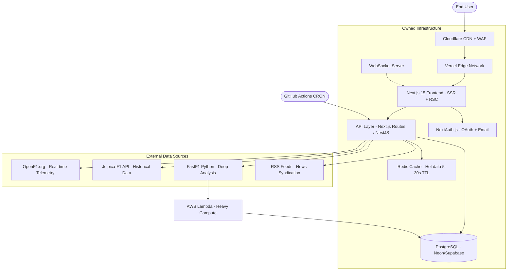

# F1 Stats — The Big F1 Blueprint

> **Mission:** Evolve F1 Stats from a clean stats dashboard into a platform that rivals — and surpasses — the official Formula 1 website through deeper data, superior interactivity, and community features.

| Field | Detail |
|---|---|
| **Document** | BIGF1 — Master Scaling Blueprint |
| **Date** | April 11, 2026 |
| **Current Version** | 2.0.1.0 |
| **Target** | Surpass formula1.com in data depth & user engagement |
| **Strategy** | Deeper Data + Superior Interactivity + Community |

---

## Current State vs Official F1

| Dimension | formula1.com | F1 Stats (Today) | F1 Stats (Target) |
|---|---|---|---|
| **Data Depth** | Proprietary AWS telemetry, surface-level stats | Jolpica API + Supabase fallback, driver/constructor profiles | OpenF1 real-time telemetry + FastF1 deep analysis + custom computed metrics |
| **Interactivity** | Mostly static content + embedded videos | 3D tilt cards, cursor glow, scroll reveals, glassmorphism | Live timing, telemetry graphs, strategy simulators, AI chatbot |
| **Content** | Heavy media — videos, articles, "5 Winners & Losers" | Stats-focused, clean dark UI | Stats + analytics + community content + race recaps |
| **Community** | None (broadcast-only) | Basic auth | User profiles, fantasy league, forums, personalized dashboards |
| **Performance** | Slow, ad-heavy, media overload | Fast, lightweight | Ultra-fast (<1s load), SSR, edge-cached |
| **SEO** | Strong (brand authority) | Dynamic meta tags (v2.0) | Full SSR + structured data + 100/100 Lighthouse |
| **Mobile** | Responsive but bloated | Tailwind responsive + hamburger nav | PWA / React Native app |

> **Key Insight:** The official site wins on brand and media licensing. We win on **analytical depth**, **interactivity**, **performance**, and **community** — areas where no licensing restrictions apply.

---

## Phase 0 — Foundation Upgrade (Tech Stack)

> **Goal:** Rebuild the infrastructure to support professional-scale traffic, SEO, and real-time features.

### ✅ Already Done

| Component | Current Implementation |
|---|---|
| Frontend | React 18 + TypeScript + Vite 5 + Tailwind CSS 3 |
| Styling | Glassmorphism dark theme, Space Grotesk + Inter |
| Database | Supabase PostgreSQL (fallback cache) |
| Auth | Supabase email/password auth |
| Data Sync | GitHub Actions CRON (every 30 min) |
| Deployment | Render Cloud Infrastructure |
| Analytics | Cloudflare Web Analytics |

### 🔲 To Be Done

| Component | Upgrade To | Why |
|---|---|---|
| **Framework** | Next.js 15 (App Router) | SSR for SEO, API routes for backend, React Server Components for performance |
| **UI Library** | shadcn/ui + Radix primitives | Premium, accessible, composable components replacing custom-built ones |
| **Backend API** | Next.js API routes or NestJS | Dedicated API layer for data processing, FastF1 integration, custom metrics |
| **Caching** | Redis (Upstash or self-hosted) | Hot data caching (<1s reads) during live sessions — 5-30 second refresh |
| **Database** | PostgreSQL (Neon or Supabase) | User data, cached standings, custom stats, fantasy league data |
| **Hosting** | Vercel (frontend) + AWS Lambda (compute) | Auto-scaling during race weekends, edge caching, global CDN |
| **CDN** | Cloudflare | WAF protection, edge caching, image optimization, DDoS mitigation |
| **Real-time** | WebSockets (Socket.io) + Supabase Realtime | Live timing, push notifications, instant leaderboard updates |
| **State** | TanStack Query (React Query) | Server state management, automatic cache invalidation, optimistic updates |

### Architecture Diagram



---

## Phase 1 — Match Official Basics

> **Goal:** Achieve feature parity with formula1.com's core content pages, but with better performance and cleaner design.
>
> **Timeline:** Weeks 1–4

### Checklist

| # | Feature | Priority | Effort | Status |
|---|---|---|---|---|
| 1.1 | **Full Standings Tables** — Driver & Constructor with flags, team colors, points progression mini-charts inline | High | Medium | 🔲 Pending |
| 1.2 | **Detailed Weekend Results** — Session breakdowns (FP1, FP2, FP3, Qualifying, Sprint, Race) with full classifications | High | Medium | 🔲 Pending |
| 1.3 | **Pit Stop Data** — Per-race pit stop times, strategies, undercuts/overcuts highlighted | High | Medium | 🔲 Pending |
| 1.4 | **Fastest Laps** — Highlighted in results with purple sector indicators | Medium | Low | 🔲 Pending |
| 1.5 | **Calendar Upgrade** — Session times with timezone conversion, circuit maps, live weather forecasts | High | Medium | 🔲 Pending |
| 1.6 | **Live Notification Banner** — "Session Starting Soon", "Telemetry Live", "Red Flag" real-time alerts | High | Medium | 🔲 Pending |
| 1.7 | **Next Race Countdown Hero** — Dynamic hero section with countdown timer + current championship leader card | Medium | Low | 🔲 Pending |
| 1.8 | **Navigation Revamp** — Top bar: Home / Live / Standings / Results / Calendar / Drivers / Analytics / Community | Medium | Low | 🔲 Pending |

---

## Phase 2 — Visual & Interactive Upgrades

> **Goal:** Surpass the official site with rich data visualizations and interactive tools that no other F1 platform offers.
>
> **Timeline:** Weeks 5–12

### Charts & Visualizations

| # | Feature | Library | Priority | Effort | Status |
|---|---|---|---|---|---|
| 2.1 | **Points Progression Charts** — Line charts tracking championship points race-by-race for all drivers/constructors | Recharts | High | Medium | 🔲 Pending |
| 2.2 | **Lap Time Comparisons** — Side-by-side driver delta charts (sector-by-sector breakdown) | Recharts | High | Medium | 🔲 Pending |
| 2.3 | **Track Position Heatmaps** — 2D circuit overlay showing where drivers gain/lose time | Plotly / D3.js | Medium | High | 🔲 Pending |
| 2.4 | **2D Race Replay** — Animated race replay showing position changes lap-by-lap on circuit layout | D3.js + Canvas | Medium | Very High | 🔲 Pending |
| 2.5 | **Telemetry Graphs** — Speed, throttle, brake, DRS vs time for any driver/lap | Recharts | High | Medium | 🔲 Pending |
| 2.6 | **Tyre Strategy Visualization** — Compound usage timeline (soft/medium/hard/inter/wet) per driver per race | Custom SVG | Medium | Medium | 🔲 Pending |
| 2.7 | **Qualifying Gap Bars** — Horizontal bar chart showing gaps from pole position | Recharts | Medium | Low | 🔲 Pending |

### Interactive Features

| # | Feature | Priority | Effort | Status |
|---|---|---|---|---|
| 2.8 | **Live Timing Page** — Real-time leaderboard with sector times, gaps, intervals, mini-sectors (via OpenF1 WebSocket) | Critical | Very High | 🔲 Pending |
| 2.9 | **Head-to-Head Comparisons** — Select any 2 drivers, compare career stats, season stats, qualifying vs race pace | High | Medium | 🔲 Pending |
| 2.10 | **Driver/Team Profiles v2** — Career timelines, bio deep-dives, stat cards with animated counters | Medium | Medium | 🔲 Pending |
| 2.11 | **Onboard Lap Viewer** — Circuit map with GPS trace overlay + speed data synced to video timestamps | Low | Extreme | 🔲 Pending |
| 2.12 | **Multimedia Section** — Embedded highlight clips, analysis videos, onboard cameras | Medium | Medium | 🔲 Pending |

---

## Phase 3 — Go Bigger Than Official

> **Goal:** Build features that the official site **cannot or will not** offer — making F1 Stats the go-to destination for hardcore fans and data enthusiasts.
>
> **Timeline:** Months 2–6+

### Advanced Analytics

| # | Feature | Priority | Effort | Status |
|---|---|---|---|---|
| 3.1 | **Qualifying vs Race Performance Index** — Custom metric: how much a driver gains/loses from qualifying to race finish | High | Medium | 🔲 Pending |
| 3.2 | **Tire Strategy Simulator** — "What if Driver X pitted 3 laps earlier?" interactive tool | High | Very High | 🔲 Pending |
| 3.3 | **"What If" Scenarios** — Simulate alternate championship outcomes (e.g., "What if DNFs didn't happen?") | Medium | High | 🔲 Pending |
| 3.4 | **Consistency Index** — Custom computed metric tracking finish position variance across a season | Medium | Medium | 🔲 Pending |
| 3.5 | **Overtake Efficiency** — Track overtakes per race, successful vs attempted, mapped to circuit sectors | Medium | High | 🔲 Pending |
| 3.6 | **Monte Carlo Championship Sim** — Probability-based season outcome predictions using historical data | Low | Very High | 🔲 Pending |
| 3.7 | **Era-Adjusted Comparisons** — Compare drivers across eras with normalized metrics (e.g., Antonelli 2026 vs Senna 1991) | Low | High | 🔲 Pending |

### Community Features

| # | Feature | Priority | Effort | Status |
|---|---|---|---|---|
| 3.8 | **User Accounts v2** — OAuth login (Google, GitHub, Discord) via NextAuth.js with profile pages | High | Medium | 🔲 Pending |
| 3.9 | **Fantasy League** — In-house fantasy F1 with custom scoring, leagues, leaderboards | High | Very High | 🔲 Pending |
| 3.10 | **Personalized Dashboard** — "My Favorite Drivers/Teams" with custom widgets and alerts | Medium | High | 🔲 Pending |
| 3.11 | **Race Discussion Forums** — Per-race comment threads with upvoting and moderation | Medium | High | 🔲 Pending |
| 3.12 | **Predictions & Polls** — Pre-race polls ("Who wins?"), post-race ratings, community predictions leaderboard | Medium | Medium | 🔲 Pending |

### AI-Powered Features

| # | Feature | Priority | Effort | Status |
|---|---|---|---|---|
| 3.13 | **AI Stats Chatbot** — Natural language queries: "Compare Verstappen 2023 vs Antonelli 2026" | Medium | Very High | 🔲 Pending |
| 3.14 | **AI Race Recaps** — Auto-generated post-race summaries with key moments, strategy analysis | Medium | High | 🔲 Pending |
| 3.15 | **AI Insights** — Machine learning predictions for qualifying, race pace, championship probabilities | Low | Extreme | 🔲 Pending |

### Content & Media

| # | Feature | Priority | Effort | Status |
|---|---|---|---|---|
| 3.16 | **News & Race Recaps Blog** — "Winners & Losers" style articles, editor's picks, race reviews | Medium | Medium | 🔲 Pending |
| 3.17 | **Content CMS** — Headless CMS (Sanity/Contentful) for managing articles, media, and editorial content | Medium | High | 🔲 Pending |
| 3.18 | **Video Embeds** — Curated highlight clips, analysis breakdowns, onboard cameras (where legally permitted) | Low | Medium | 🔲 Pending |

### Mobile & Distribution

| # | Feature | Priority | Effort | Status |
|---|---|---|---|---|
| 3.19 | **Progressive Web App (PWA)** — Installable app with offline support, push notifications | High | Medium | 🔲 Pending |
| 3.20 | **React Native App** — Native iOS/Android app built from shared React component library | Medium | Extreme | 🔲 Pending |
| 3.21 | **Push Notifications** — Race start alerts, red flags, championship-clinching moments | Medium | Medium | 🔲 Pending |

---

## Data Source Architecture

> **Principle:** Fetch from multiple sources, cache aggressively, compute custom value-added metrics server-side.

### Primary Data Sources (Free & Powerful)

| Source | Best For | Refresh Rate | Auth Required |
|---|---|---|---|
| **[OpenF1.org](https://openf1.org)** | Real-time telemetry, lap times, weather, race control, car data, radio messages | 5–30 seconds (live) | ❌ No |
| **[Jolpica-F1](https://jolpi.ca)** | Historical data (1950–2026), standings, results, qualifying, circuits | 5 minutes | ❌ No |
| **[FastF1](https://docs.fastf1.dev)** | Deep telemetry analysis, sector times, strategy simulation, tire degradation models | On-demand (server-side) | ❌ No |
| **Motorsport.com RSS** | Breaking news, race reports, editorial content | 15 minutes | ❌ No |
| **Wikipedia** | Circuit specs, driver bios, historical records, track maps | Daily | ❌ No |

### Custom Computed Metrics (Our Competitive Edge)

| Metric | Formula / Method | Value Proposition |
|---|---|---|
| **Consistency Index** | Standard deviation of finishing positions over N races | Identifies the most reliable drivers beyond raw points |
| **Qualifying vs Race Delta** | Average positions gained/lost from grid to finish | Shows who overperforms on Sundays vs Saturdays |
| **Overtake Efficiency** | Successful overtakes / Total attempts × 100 | Quantifies racecraft beyond just position changes |
| **Tire Management Score** | Lap time degradation curve slope over stint length | Reveals who preserves tires best |
| **Wet Weather Index** | Performance delta in wet vs dry conditions | Identifies true rain masters |
| **Championship Probability** | Monte Carlo simulation (10,000 runs) using historical variance | Predicts title outcomes with confidence intervals |
| **Era-Adjusted Rating** | Normalize stats by grid size, reliability, field strength | Enables fair cross-era driver comparisons |

These metrics are **proprietary value-adds** that no other platform (including the official site) currently offers.

---

## Design & UX Strategy

### Design Principles

| Principle | Implementation |
|---|---|
| **Premium Dark Theme** | Keep the current dark glassmorphism aesthetic — cleaner than official's media overload |
| **Red Accent System** | F1-inspired red accents (#E10600) for key interactions, alerts, and CTAs |
| **Data Density Control** | User-selectable: Compact (pro analysts), Comfortable (casual fans), Spacious (mobile) |
| **Micro-animations** | Subtle motion for state changes, loading, and transitions — never flashy, always functional |
| **Performance-First** | Target <1s page load, <100ms interaction response, 90+ Lighthouse on all metrics |

### Navigation Structure

```
┌─────────────────────────────────────────────────────┐
│  🏎️ F1 STATS    Home  Live  Standings  Results      │
│                  Calendar  Drivers  Analytics        │
│                  Community  Settings                 │
├─────────────────────────────────────────────────────┤
│                                                     │
│  [Dynamic Hero: Next Race Countdown + Leader Card]  │
│                                                     │
│  ┌──────────┐  ┌──────────┐  ┌──────────┐          │
│  │ Standings │  │ Results  │  │ Live     │          │
│  │ Widget   │  │ Widget   │  │ Timing   │          │
│  └──────────┘  └──────────┘  └──────────┘          │
│                                                     │
│  [Charts]  [News Feed]  [Community Activity]        │
│                                                     │
└─────────────────────────────────────────────────────┘
```

### Performance Targets

| Metric | Target | How |
|---|---|---|
| **First Contentful Paint** | < 0.8s | SSR with Next.js, preconnect hints, font-display: swap |
| **Largest Contentful Paint** | < 1.2s | Image optimization (WebP/AVIF), lazy loading, priority hints |
| **Time to Interactive** | < 1.5s | Code splitting, React.lazy(), dynamic imports for heavy charts |
| **Cumulative Layout Shift** | < 0.05 | Skeleton loaders (already built ✅), reserved image dimensions |
| **Lighthouse Score** | 95+ (all categories) | SSR, semantic HTML, ARIA labels, structured data |

---

## Legal & Practical Considerations

### Data Usage

| Source | License | Restrictions |
|---|---|---|
| OpenF1.org | Open / Free | Fan projects OK, no commercial resale of raw data |
| Jolpica-F1 | Open / Free | Fan projects OK, attribute source |
| FastF1 | MIT License | Open source, no restrictions |
| Official F1 Content | ⚠️ **Restricted** | Do NOT scrape formula1.com or use official logos/images without license |

### Branding Guidelines

- ✅ Use original "F1 STATS" branding, custom logos, generic racing assets
- ✅ Create original illustrations, infographics, data visualizations
- ❌ Do NOT use official F1 logo, FIA trademarks, or team logos without permission
- ❌ Do NOT scrape or embed official F1 website content directly

### Monetization Strategy (To Sustain "Bigger")

| Tier | Price | Features |
|---|---|---|
| **Free** | $0 | Standings, results, calendar, basic stats, news feed |
| **Pro** | $3/mo | Advanced telemetry, head-to-head comparisons, strategy simulator, AI chatbot, ad-free |
| **Team** | $10/mo | Fantasy league management, API access, export tools, priority support |

### Sustainability

| Revenue Stream | Estimated Monthly |
|---|---|
| Pro subscriptions (500 users) | $1,500 |
| Ads (non-intrusive, 50K pageviews) | $200–500 |
| Donations / Sponsorships | Variable |
| **Infrastructure Cost** | −$50 to −$200 |

---

## Realistic Timeline

### 🗓️ Week 1–2: Foundation

| Task | Action |
|---|---|
| Audit current codebase | Identify components to keep, refactor, or rewrite |
| Next.js migration plan | Map current React Router routes to Next.js App Router |
| Integrate OpenF1 | Add real-time telemetry endpoints alongside existing Jolpica |
| Set up Redis | Upstash Redis for live session caching |

### 🗓️ Weeks 3–4: Core Parity

| Task | Action |
|---|---|
| Full standings tables | Flags, team colors, inline progression mini-charts |
| Weekend results pages | FP1–Race session breakdowns with full classifications |
| Calendar upgrade | Timezone conversion, weather, circuit info |
| Live notification banner | Real-time session status alerts |

### 🗓️ Weeks 5–8: Visualizations

| Task | Action |
|---|---|
| Points progression charts | Recharts line charts for championship battle |
| Lap time comparisons | Sector-by-sector driver deltas |
| Telemetry graphs | Speed/throttle/brake traces |
| Tire strategy visualization | Compound timelines per driver |
| Live timing prototype | Real-time leaderboard via OpenF1 WebSocket |

### 🗓️ Weeks 9–12: Profiles & Comparisons

| Task | Action |
|---|---|
| Driver profiles v2 | Career timelines, deep stat cards |
| Head-to-head tool | Any 2 drivers, any metric, any season |
| Team profiles v2 | Historical performance arcs |
| Qualifying gap visualization | Pole delta bar charts |

### 🗓️ Months 4–6: Community & AI

| Task | Action |
|---|---|
| OAuth user accounts | NextAuth.js with Google/GitHub/Discord |
| Fantasy league MVP | Basic scoring, leagues, leaderboards |
| AI chatbot prototype | Natural language stats queries |
| Race discussion threads | Per-race comment system |
| Personalized dashboards | Custom widget layouts |

### 🗓️ Months 6+: Scale & Polish

| Task | Action |
|---|---|
| PWA conversion | Offline support, push notifications |
| Performance audit | Target 95+ Lighthouse across all pages |
| Mobile app | React Native or TWA |
| Monetization | Stripe integration for Pro tier |
| Content CMS | Headless CMS for editorial content |

---

## Summary: How We Beat formula1.com

| Dimension | Official F1 | F1 Stats (Target) | Our Advantage |
|---|---|---|---|
| **Data Depth** | Surface stats + proprietary telemetry | 3 open APIs + FastF1 + 7 custom metrics | More analytical depth, free to access |
| **Interactivity** | Static pages + embedded video | Live timing + telemetry graphs + strategy sim + AI chatbot | Interactive tools, not just content consumption |
| **Community** | None | Fantasy leagues + forums + predictions + personalized dashboards | Fan engagement and retention |
| **Performance** | Slow, ad-heavy | <1s loads, SSR, edge-cached | Superior user experience |
| **Cost** | Free (ad-supported) | Freemium ($0 basic / $3 pro) | Sustainable, no intrusive ads |
| **Mobile** | Responsive web + paid app | PWA + React Native (free) | Free mobile app with offline support |
| **Innovation** | Corporate, slow to change | Agile, community-driven, AI-powered | Ship fast, iterate weekly |

> **The official site will always win on brand recognition and exclusive media rights. We win on everything else — deeper data, better tools, faster performance, and genuine community.**

---

*Blueprint authored for **[F1 Stats](https://statsf1web.onrender.com)** by **[Kiiirtan](https://github.com/Kiiirtan)***
