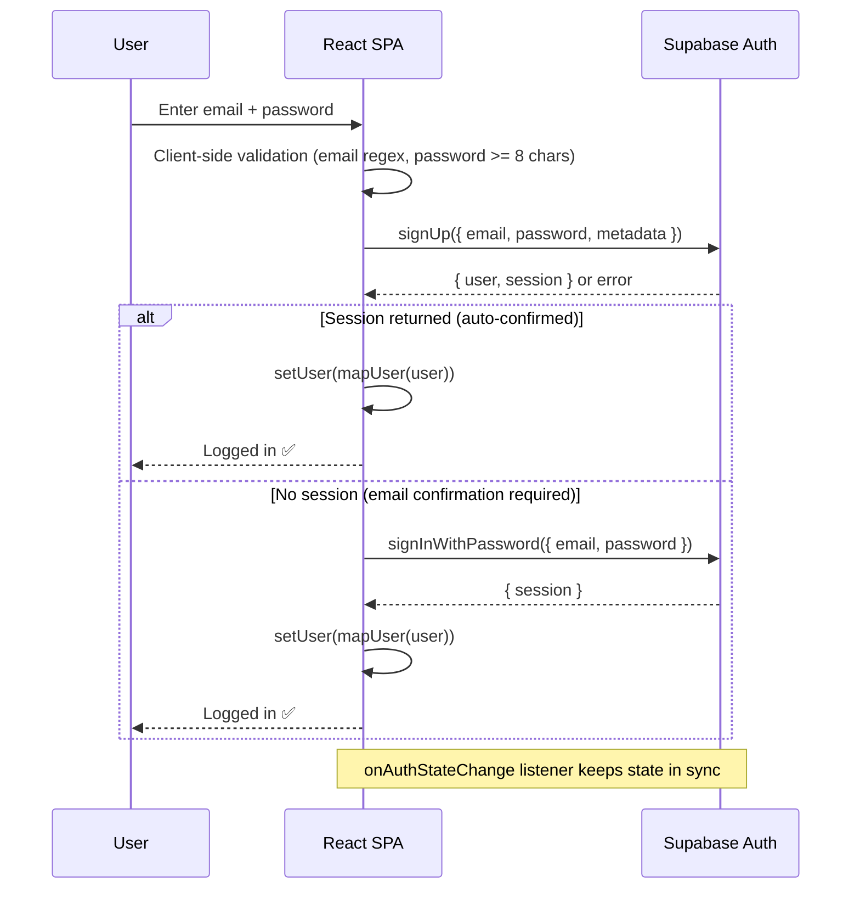

# F1 Stats — Cybersecurity Threat Model & Defense Report

> **Classification:** Internal Engineering Reference
> **Version:** 2.0 (Updated for v2.0.1.0)
> **Date:** April 11, 2026
> **Scope:** Threat analysis for a Vite/React SPA with Supabase Auth & DB, deployed on Render
> **Author:** Security Audit — Dual Red/Blue Team Analysis

---

## Executive Summary — What Changed Since v1.0 of This Report

| Item | Status in v1.0 (Apr 4) | Status Today (Apr 11) |
|---|---|---|
| `.env` committed to Git | ⚠️ **CRITICAL** — keys exposed | ✅ **FIXED** — `.gitignore` covers `.env` and `.env.*`, files are NOT tracked |
| `.env` in Git history | ⚠️ Risk | ✅ **CLEAN** — `.env` was never committed to Git history (verified) |
| Authentication | ❌ None (localStorage demo) | ✅ **Supabase Auth** — real email/password, session management, input validation |
| `dangerouslySetInnerHTML` | ✅ Not used | ✅ Still not used (verified via codebase search) |
| Security headers (CSP, X-Frame, etc.) | ❌ Not implemented | ❌ **Still not implemented** — no CSP, no X-Frame-Options |
| Temp/debug files in root | ⚠️ Present | ⚠️ **Still present** — 8 temp files remain in root |
| Supabase RLS | ❌ Not configured | ❓ **Unknown** — not verifiable from client code, needs dashboard check |
| Rate limiting | ❌ None | ❌ **Still none** — no request throttling |
| CDN (Cloudflare) | ❌ Not configured | ❌ **Still not configured** — origin IP exposed |
| CRON sync uses service key | ✅ Via GitHub Secrets | ✅ Still secure — `SUPABASE_SERVICE_KEY` in `secrets`, not in code |

---

## Phase 1: Anatomy of the Attack (Red Team Perspective)

Understanding how attacks work is the foundation of building defensible systems.

---

### 1A. DDoS Attack Mechanics — Layer 7 vs. Volumetric

#### DNS Amplification (Layer 3/4 — Volumetric)

**Goal:** Saturate the target's bandwidth so legitimate traffic can't reach the server.

**How it works conceptually:**

1. **Reconnaissance** — Attacker identifies the target's public IP (e.g., your Render deployment's origin IP). Tools like DNS lookups, certificate transparency logs, and header analysis can reveal origin IPs even behind CDNs if misconfigured.

2. **Amplification Abuse** — The attacker sends small DNS queries to thousands of open DNS resolvers, but **spoofs the source IP** to be your server's IP. Each 60-byte query generates a ~4,000-byte response directed at your server. This is a **~65x amplification factor**.

3. **Flood** — Your server's network interface receives gigabits/sec of unsolicited DNS response traffic. The hosting provider's upstream links saturate. Legitimate HTTP requests can't reach your app — they time out or get dropped at the network layer.

**Key characteristics:**
- Doesn't need to understand your app at all
- Targets raw bandwidth
- Source IPs are spoofed, so blocking individual IPs is useless
- Requires the attacker to control a botnet or leverage misconfigured resolvers

```
┌──────────┐    60-byte query     ┌────────────────┐
│ Attacker │ ──(spoofed src IP)──▶│ Open DNS       │
│          │                      │ Resolvers (1000s)│
└──────────┘                      └───────┬────────┘
                                          │ 4,000-byte responses
                                          │ (×1000s resolvers)
                                          ▼
                                  ┌──────────────┐
                                  │ YOUR SERVER  │ ← Drowning in
                                  │ (Render)     │   unsolicited traffic
                                  └──────────────┘
```

#### Layer 7 (Application-Layer) DDoS

**Goal:** Exhaust your server's CPU/memory/connections by making expensive but seemingly legitimate requests.

**How it works conceptually:**

1. **App Profiling** — Attacker studies your application to find expensive endpoints. For your F1 Stats app, the costliest pages are:
   - `/driver/:id` — triggers 3+ parallel API calls to Jolpica (wins, poles, all seasons + per-season standings)
   - `/constructor/:id` — triggers 5+ API calls including season history (last 15 seasons), current/previous year standings, all drivers
   - `/circuits` — renders up to 77 circuit cards with potential Wikipedia scraping on profile pages

2. **Slowloris / Slow POST Variants** — Open thousands of connections to your server but send data extremely slowly (1 byte per second). Each connection holds a server thread/socket open. Your server's connection pool exhausts while the attacker uses minimal bandwidth.

3. **HTTP Flood** — Send thousands of valid-looking `GET /driver/verstappen` requests per second from distributed IPs. Each request is indistinguishable from a real user. Your app spins up API calls to Jolpica for each one, exhausting both your server resources AND getting your IP rate-limited by Jolpica.

4. **Cache-Busting** — Add random query parameters (`?cachebust=abc123`) to bypass CDN caches, forcing requests to hit your origin server every time.

**Key characteristics:**
- Low bandwidth, high CPU impact
- Each request looks legitimate
- Hard to distinguish from real traffic
- Targets application logic, not just bandwidth

**Why your app is still vulnerable:**
- No request rate limiting at application level
- No concurrency control on downstream API calls
- Each page load fires 3-15+ downstream API requests (amplification against Jolpica)
- In-memory cache only — bypassed if a new user visits
- No CDN caching configured for API responses

---

### 1B. Malicious Payload Mechanics — Modern Malware Lifecycle

#### Attack Vector Analysis (Relevant to Your Stack)

Your app is now an **SPA with real Supabase Auth** (email/password), Supabase database integration, and external API consumption. The attack surface has expanded compared to v1.

**Supply Chain Attack (Most Realistic Threat):**

1. **Dependency Compromise** — Your `package.json` has 4 runtime + 8 dev dependencies (12 direct, 100s transitive). An attacker compromises a popular npm package (or its subdependency). When you run `npm install`, malicious code executes in a `postinstall` script.

2. **What happens:**
   - The script reads environment variables (your Supabase keys are in `.env` locally)
   - Exfiltrates them to an external server
   - May inject a backdoor into your `node_modules` that modifies your build output
   - Your production bundle now contains code that runs in every visitor's browser

3. **Persistence:**
   - The compromised package stays in your `package-lock.json`
   - Every CI/CD rebuild reinfects
   - The injected client-side code can: steal auth tokens, redirect users, mine crypto, or serve as a watering hole for further attacks

**Supabase Credential Abuse:**

> **UPDATE (v2.0.1.0):** The `.env` file was **never committed to Git history** (verified). The anon key is exposed only in the browser bundle at runtime (standard for Supabase SPAs), NOT in the Git repository.

1. **Attacker extracts the anon key** from the browser's network tab or bundled JS (this is by design for Supabase client-side use)
2. Uses the anon key to query your Supabase directly:
   ```
   GET https://<your-project>.supabase.co/rest/v1/api_cache
   Authorization: Bearer <anon_key_from_browser>
   ```
3. **With proper RLS:** Can only READ public data (intended behavior) ✅
4. **Without RLS:** Can potentially INSERT/UPDATE/DELETE cache entries → **data poisoning** ⚠️
   - Replace legitimate F1 standings data with fake data
   - Inject malicious URLs into cached JSON that `onError` image handlers could load

**Client-Side Injection (XSS via Cached Data):**

Current XSS assessment:
- `dangerouslySetInnerHTML` — ✅ **Not used anywhere** (verified via full codebase search)
- `javascript:` protocol in URLs — ✅ **Not present** (verified)
- Image `onError` handlers — ⚠️ **Found in 5 pages** (News.tsx ×2, Dashboard.tsx, ConstructorProfile.tsx ×2, DriverProfile.tsx, CircuitProfile.tsx). These set fallback `src` URLs inline. If cached data included a malicious image URL, the `onError` handler itself is safe (just sets a hardcoded fallback), but the initial load attempt could be to an attacker-controlled server for tracking.
- CSS injection via `style` props — ⚠️ Low risk but unaudited

**Auth-Specific Threats (New in v2.0):**

| Threat | Risk | Notes |
|---|---|---|
| Brute force login | Medium | No client-side lockout after N failed attempts (Supabase has server-side limits) |
| Session hijacking | Low | Supabase uses HttpOnly cookies / short-lived JWTs |
| Account enumeration | Low | Supabase returns generic errors on invalid credentials ✅ |
| Password policy bypass | ✅ Mitigated | Minimum 8 chars enforced client-side, email format validated |

---

### Threat Matrix Summary (Updated for v2.0.1.0)

| Attack Vector | Likelihood | Impact | Current Exposure | Previous |
|---|---|---|---|---|
| Volumetric DDoS | Low | Medium | 🟢 LOW — Render absorbs L3/4 | Same |
| Layer 7 DDoS | Medium | High | 🔴 **HIGH — no rate limiting, no CDN** | Same |
| Supply chain (npm) | Low-Medium | Critical | 🟡 MEDIUM — standard npm, no lockfile audit | Same |
| Supabase key exposure (Git) | **Was HIGH** | Critical | 🟢 **RESOLVED** — `.env` never in Git history | Was CRITICAL |
| Supabase key in browser bundle | Low (by design) | Medium | 🟡 MEDIUM — expected for SPA, mitigate with RLS | New |
| Cache poisoning via Supabase | Medium | High | 🟡 **MEDIUM** — depends on RLS config (unverified) | Was HIGH |
| XSS via injected data | Low | High | 🟢 LOW — React escapes, no dangerouslySetInnerHTML | Same |
| CSRF / session attacks | Low | Medium | 🟢 LOW — Supabase handles session tokens securely | Was N/A |
| Info disclosure (temp files) | Low | Low | 🟡 **MEDIUM — 8 temp/debug files still in root** | Same |
| Missing security headers | Medium | Medium | 🔴 **HIGH — no CSP, X-Frame, HSTS** | Same |

---

## Phase 2: Architecture of Defense (Blue Team Perspective)

### 2A. Mitigations Already Applied ✅

| # | Mitigation | When Applied | Detail |
|---|---|---|---|
| 1 | `.env` excluded from Git | v1.0.0+ | `.gitignore` covers `.env` and `.env.*` — keys never committed |
| 2 | Supabase Auth | v2.0.0 | Real email/password auth with session management, replacing localStorage demo |
| 3 | Input validation | v2.0.1 | Email regex, password length (8+), display name length (2-30) enforced |
| 4 | Auto-login on signup | v2.0.1 | Eliminates account enumeration via "user exists" errors during manual re-login |
| 5 | Environment vars on Render | v2.0.0 | `VITE_SUPABASE_URL` and `VITE_SUPABASE_ANON_KEY` set via Render Dashboard, not `render.yaml` |
| 6 | CRON sync via GitHub Secrets | v1.3.0 | `SUPABASE_SERVICE_KEY` stored in GitHub Secrets, not in code |
| 7 | 3-tier fetch fallback | v1.3.0 | In-memory cache → Jolpica API (3 retries with exponential backoff) → Supabase DB |
| 8 | React XSS defaults | v1.0.0 | No `dangerouslySetInnerHTML`, no `javascript:` URLs, JSX auto-escaping |

---

### 2B. DDoS Mitigation Architecture

#### How Your Hosting Provider Already Helps

```
                                    ┌─────────────────┐
                                    │ Cloudflare       │
          Internet Traffic          │ (NOT YET ADDED)  │
  ──────────────────────────────▶   │                  │
  (Volumetric + L7 mixed)          │  ① L3/4 Scrubbing│ ← Drops spoofed/amplified packets
                                    │  ② Rate Limiting │ ← Per-IP request throttling
                                    │  ③ WAF Rules     │ ← Blocks known attack patterns
                                    │  ④ Edge Cache    │ ← Serves static assets without hitting origin
                                    └────────┬────────┘
                                             │ Only clean, legitimate traffic
                                             ▼
                                    ┌─────────────────┐
                                    │ YOUR ORIGIN     │
                                    │ (Render)        │
                                    │                 │
                                    │ Vite static     │
                                    │ bundle served   │
                                    └─────────────────┘
```

**What you should add:**

1. **Put Cloudflare in front of your domain** — Free tier includes L3/L4 DDoS protection, basic WAF, and edge caching. This is the single highest-ROI security action you can take.

2. **Configure CDN caching headers** — Your SPA's `index.html`, JS bundles, and CSS are static. Set `Cache-Control: public, max-age=31536000, immutable` on hashed assets. Attacks hitting cached assets never reach your origin.

3. **Rate limiting at the application level** — Even with Cloudflare, add a rate limit. Since you're a static SPA hitting external APIs, the main concern is protecting Jolpica from amplified traffic:
   - Cap concurrent Jolpica requests at 5 globally
   - Implement a request queue in your `fetchWithCache()`

---

### 2C. Zero-Trust Defense Against Payload Attacks

#### Supabase Hardening (Verify in Dashboard)

```sql
-- Enable RLS on api_cache
ALTER TABLE api_cache ENABLE ROW LEVEL SECURITY;

-- Allow anyone to READ cache (needed for fallback)
CREATE POLICY "Allow public read" ON api_cache
  FOR SELECT USING (true);

-- Only allow writes from the service role (GitHub Actions CRON, not the browser)
CREATE POLICY "Deny anon writes" ON api_cache
  FOR INSERT WITH CHECK (auth.role() = 'service_role');

CREATE POLICY "Deny anon updates" ON api_cache
  FOR UPDATE USING (auth.role() = 'service_role');

CREATE POLICY "Deny anon deletes" ON api_cache
  FOR DELETE USING (auth.role() = 'service_role');
```

**Current situation:** Your `syncToSupabase()` function in `src/lib/supabase.ts` uses the **anon key** to WRITE to `api_cache` from the browser. With the above RLS, browser writes will be blocked.

**Solution Options:**
- **Option A (Recommended):** Remove `syncToSupabase()` calls from the browser entirely. Rely solely on the GitHub Actions CRON (`sync_f1_data.yml`) which already uses the `service_role` key for writes. The browser app only needs READ access.
- **Option B:** Create a Supabase Edge Function that validates and writes cache entries. The browser calls the function (which uses the service role internally).

#### Supply Chain Defense

```jsonc
// package.json — add these scripts
{
  "scripts": {
    "preinstall": "npx npm-audit-signatures",  // Verify package signatures
    "audit": "npm audit --audit-level=high"     // Block high-severity vulns
  }
}
```

**Additional measures:**
- [ ] Run `npm audit` before every deploy
- [ ] Pin exact dependency versions (remove `^` prefixes) in `package.json`
- [ ] Use `npm ci` instead of `npm install` in CI/CD (respects lockfile exactly)
- [ ] Consider using Socket.dev or Snyk for real-time dependency monitoring
- [ ] Review the 4 runtime deps (`@supabase/supabase-js`, `react`, `react-dom`, `react-router-dom`) — all are well-maintained, low risk

#### Input Sanitization (Defense-in-Depth)

Even though React auto-escapes JSX, add a sanitization layer for data flowing from Supabase cache into the app:

```typescript
// Sanitize any cached data before rendering
function sanitizeCacheData<T>(data: T): T {
  const json = JSON.stringify(data);
  // Strip any HTML tags, script injections, javascript: URLs
  const cleaned = json
    .replace(/<script\b[^>]*>[\s\S]*?<\/script>/gi, '')
    .replace(/javascript:/gi, '')
    .replace(/on\w+\s*=/gi, '');
  return JSON.parse(cleaned);
}
```

---

## Phase 3: Tabletop Simulation

> **Scenario:** Multi-vector attack on your F1 Stats deployment
> **Status:** ⏳ Ready to begin when Phase 1 & 2 are reviewed

The simulation will present:
- Simulated server logs and Cloudflare telemetry
- Anomalous traffic patterns you must identify
- Decision points where you choose defensive actions
- A DDoS smokescreen masking a cache poisoning attempt via the browser-exposed Supabase anon key

**Begin when ready — reply "START SIMULATION" to proceed.**

---

## Appendix A: Remaining Action Items

### 🔴 Critical (Do Before Next Release)

| # | Action | Time | Risk Mitigated | Status |
|---|---|---|---|---|
| 1 | Verify RLS is enabled on `api_cache` table in Supabase Dashboard | 5 min | Cache poisoning | 🔲 Pending |
| 2 | Remove browser-side `syncToSupabase()` calls (rely on CRON only) | 15 min | Unauthorized writes | 🔲 Pending |
| 3 | Add security headers via `render.yaml` (see Appendix B) | 10 min | XSS, clickjacking, MIME sniffing | 🔲 Pending |
| 4 | Delete temp/debug files from root (see list below) | 2 min | Info disclosure | 🔲 Pending |

### 🟡 Important (Do This Sprint)

| # | Action | Time | Risk Mitigated | Status |
|---|---|---|---|---|
| 5 | Add Cloudflare DNS proxy in front of `statsf1web.onrender.com` | 15 min | L3/4 DDoS + origin IP exposure | 🔲 Pending |
| 6 | Run `npm audit --audit-level=high` and fix findings | 10 min | Supply chain vulns | 🔲 Pending |
| 7 | Pin exact dependency versions (remove `^` from `package.json`) | 5 min | Supply chain drift | 🔲 Pending |
| 8 | Add rate limiting / request queue to `fetchWithCache()` | 30 min | L7 DDoS / Jolpica abuse | 🔲 Pending |

### Temp/Debug Files Still in Root (Should Be Deleted or Gitignored)

| File | Size | Risk |
|---|---|---|
| `test_errors.txt` | 473 B | Stack trace / path disclosure |
| `tmp_silverstone_debug.js` | 1,569 B | Debug script leaks internal logic |
| `tsc.txt` | 200 B | TypeScript error output |
| `search1.txt` | 2 B | Dev artifact |
| `search2.txt` | 2 B | Dev artifact |
| `scratch_meta.py` | 2,812 B | Python scraper with potential internal URLs |
| `fix-imports.mjs` | 1,840 B | Build migration script |
| `update-colors.mjs` | 1,017 B | One-time color migration script |

---

## Appendix B: Security Headers to Add

Add to `render.yaml` under the static site `headers` configuration, or implement via Cloudflare:

```yaml
services:
  - type: web
    name: f1-stats-app
    env: static
    buildCommand: npm install && npm run build
    staticPublishPath: ./dist
    headers:
      - path: /*
        name: X-Content-Type-Options
        value: nosniff
      - path: /*
        name: X-Frame-Options
        value: DENY
      - path: /*
        name: X-XSS-Protection
        value: "1; mode=block"
      - path: /*
        name: Referrer-Policy
        value: strict-origin-when-cross-origin
      - path: /*
        name: Permissions-Policy
        value: "camera=(), microphone=(), geolocation=()"
      - path: /*
        name: Content-Security-Policy
        value: >-
          default-src 'self';
          script-src 'self';
          style-src 'self' 'unsafe-inline' https://fonts.googleapis.com;
          font-src 'self' https://fonts.gstatic.com;
          img-src 'self' https: data:;
          connect-src 'self' https://api.jolpi.ca https://*.supabase.co https://api.rss2json.com;
          frame-src 'none'
    routes:
      - type: rewrite
        source: /*
        destination: /index.html
    envVars:
      - key: VITE_SUPABASE_URL
        sync: false
      - key: VITE_SUPABASE_ANON_KEY
        sync: false
```

---

## Appendix C: Current Auth Architecture



**Validation enforced:**
- Email: trimmed, lowercased, regex validated (`^[^\s@]+@[^\s@]+\.[^\s@]+$`)
- Password: minimum 8 characters
- Display name: 2–30 characters
- Rate limit errors surfaced to user with guidance

---

*This report is a living document. Last updated: April 11, 2026 (v2.0.1.0).*
*Previous version: April 4, 2026 (v1.0.0.0).*
