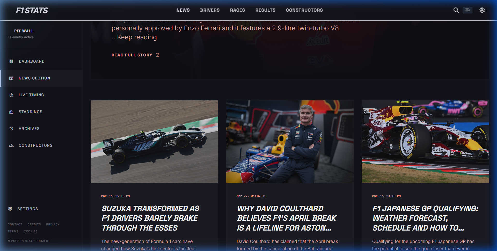
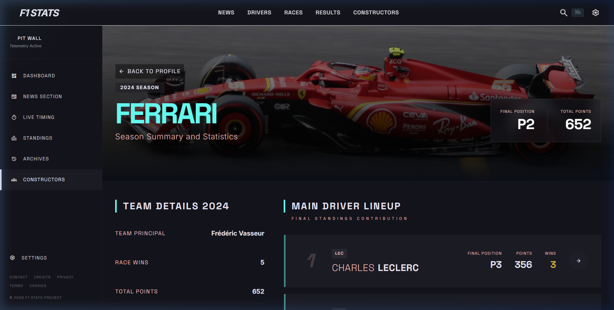
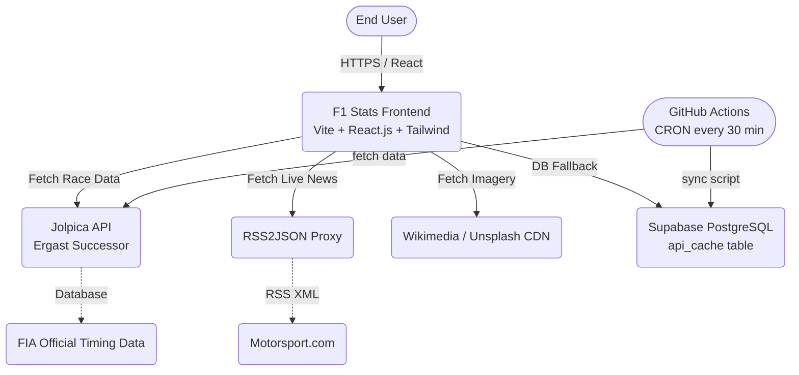
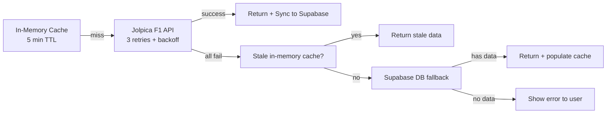
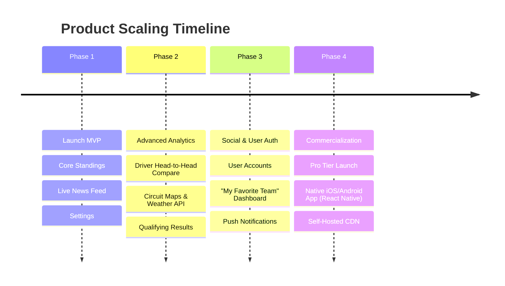

# F1 Stats — Pitch Deck Presentation

**Lead Developer:** Kirtan Patidar

An ultra-premium, real-time analytics platform built for the modern Formula 1 fan. Bridging the gap between raw data and high-fidelity UX design.
  
> [!TIP]
> **Mission Statement:** To provide the fastest, most aesthetically pleasing, and comprehensive F1 statistics dashboard on the web without the clutter of traditional sports sites.

---
# The Problem & The Market

**The Problem:**
Current F1 data websites suffer from severe UX bloat. They are plagued by ad-clutter, slow page loads, outdated UI structures, and disjointed navigation between News and Data. Hardcore fans suffer from poor data accessibility.

**The Market Aspect:**
- **Massive Audience:** Formula 1 has over **500 million global fans**, with rapid growth in the US (fueled by *Drive to Survive*).
- **High Engagement:** Modern fans are data-hungry. They care about sector times, constructor points, and historical context just as much as the live race.
- **The Gap:** There is a distinct lack of "Premium" free-tier data aggregators. F1 Stats captures the premium demographic.

---
# Key Product Features

- **Live Driver & Constructor Standings:** Updating ~2hrs after the chequered flag.
- **Real-Time Global News:** Direct RSS syndication via RSS2JSON ensuring fans get breaking news instantly.
- **Deep Historical Context:** Unprecedented season-by-season breakdowns and driver/constructor career analytics.
- **Circuit Encyclopedia:** Full circuit browser with race history, podium records, and physical track specs.
- **Season Calendar:** Detailed schedules with FP1, Qualifying, Sprint, and Race session times.
- **Driver Career Stats:** Championships, wins, poles, and full season-by-season history for every driver.
- **Premium UI/UX:** Built on Material Design 3 dark-mode principles with heavy contrast, semantic coloring, and high-fidelity racing photography.
- **Zero-Downtime Architecture:** Supabase database fallback + GitHub Actions CRON ensures data availability even when APIs are down.
- **Settings & Personalization:** Theme (Dark/Light), accent colors, animation preferences, and default page configuration.
- **Real Authentication:** Supabase Auth with email/password, input validation, and auto-login on signup.
- **Premium Loading States:** Page-specific skeleton shimmer loaders that match the actual layout.

---
# Showcase: Advanced Analytics

The platform isn't just a list of numbers; it visualizes the history of the sport.
Below is the highly detailed **Constructor Season Dashboard**, parsing and displaying the exact point contribution and final position of every driver for a specific historical team lineup.

Additionally, the **Driver Profile** pages feature full career analytics — tracking championships, wins, poles, and season-by-season performance across the driver's entire career (fetched dynamically from per-season API endpoints).

---
# Technical Architecture

Our stack is built for **speed, scale, and extremely low latency** with **zero-downtime data resilience**.

---
# Data Resilience Strategy

F1 Stats implements a **3-tier fallback** to ensure zero downtime:

---
# Business Models & Monetization

How does F1 Stats generate revenue in the future?

1. **Freemium Pro Tier (B2C):**
   - **Free:** Current standings, news, basic constructor profiles, settings.
   - **Pro ($3/mo):** In-depth telemetry, advanced Head-to-Head driver comparison charts, and ad-free live session timing.
2. **Affiliate & Partner Integrations (B2B):**
   - Integrating seamless affiliate links for F1 Merchandise, Ticket Sales (e.g., F1 Experiences), and sim-racing gear.
3. **Fantasy League Integration:**
   - Partnering with existing Fantasy F1 apps to act as their premium "Data Provider" or building an in-house betting odds display overlay.

---
# SWOT Analysis

### Strengths
- **Lightning Fast:** SPA architecture means instant page transitions.
- **Zero Operating Cost:** Relies on free, robust open-source APIs (Jolpica) with Supabase free tier for fallback.
- **Zero Downtime:** 3-tier data fallback (cache → Supabase → error) ensures consistent availability.
- **Stunning UI:** Differentiator in a market of boring, spreadsheet-like sports websites.
- **Comprehensive Data:** 18+ pages covering drivers, constructors, circuits, calendar, news, and settings.

### Weaknesses
- **API Dependency:** Reliant on third-party uptime (Jolpica F1 API), mitigated by Supabase fallback.
- **Image Licensing:** Relying on Wikipedia Creative Commons limits exclusive branding.
- **No Official Telemetry:** We lack live-lap GPS data without paying exorbitant FIA commercial fees.
- **Client-Side Rendering:** SEO limited without SSR migration (mitigated by dynamic meta tags).

---
# The Future Roadmap

What's next for F1 Stats?

**Conclusion:** F1 Stats represents the pinnacle of modern sports data visualization. It is lean, beautiful, resilient, and ready to scale to millions of passionate racing fans.
