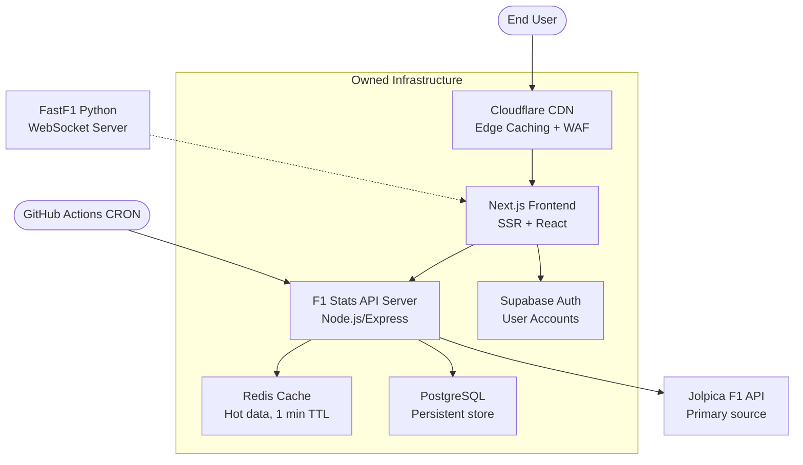

# F1 Stats — Scaling Guide & Architecture V2 Roadmap

This document outlines the current structural limitations and provides specific, technical architectural upgrades required to transition F1 Stats into a highly scalable, commercial-grade F1 platform.

---

## Current Architecture Status

F1 Stats has already addressed some critical architectural concerns since v1.0:

| Concern | Status | Implementation |
|---|---|---|
| API single point of failure | ✅ Mitigated | Supabase PostgreSQL fallback with GitHub Actions CRON sync |
| Data freshness during downtime | ✅ Mitigated | Automated sync every 30 minutes via `sync_f1_data.yml` |
| User preferences | ✅ Implemented | SettingsContext with localStorage persistence |
| Theme support | ✅ Implemented | Dark/Light mode via Tailwind + CSS variables |
| Mobile responsiveness | ✅ Implemented | Full responsive design across all 19 pages |

---

## 1. The API Dependency (Partially Solved)

**The Original Problem:**
The Vite frontend made direct network requests to free third-party APIs (`Jolpica` and `AllOrigins`). If these free APIs crashed during high traffic, the entire F1 Stats dashboard went completely offline.

**What We've Done:**
- ✅ Implemented **Supabase PostgreSQL** as a persistent fallback cache (`api_cache` table).
- ✅ Created **GitHub Actions CRON** (`sync_f1_data.yml`) that syncs Jolpica data to Supabase every 30 minutes.
- ✅ The `fetchWithCache()` function now has a 3-tier fallback: in-memory cache → Jolpica API (3 retries) → Supabase DB.

**What Still Needs to Be Done (for true scale):**
- **Architecture:** Build a dedicated backend (Node.js/Express or Go) that serves as the sole data provider.
- **Implementation:** Replace direct Jolpica calls from the client with calls to your own API server that maintains a Redis + PostgreSQL cache.
- **Result:** Millions of users hit *your* controlled infrastructure instead of a free third-party API.

---

## 2. Client-Side Rendering & SEO Penalties

**The Problem:**
Vite generates a Single Page Application (SPA). When Googlebot crawls the site, it only sees `

`. This severely damages SEO rankings and delays the First Contentful Paint (FCP) on slow devices.

**The Solution (SSR Migration):**
- **Architecture:** Migrate the entire React codebase to a modern meta-framework like **Next.js 14 (App Router)** or **Remix / Astro**.
- **Implementation:** Utilize Server-Side Rendering (SSR) or Static Site Generation (SSG). Next.js will pre-render the entire *Constructor Profile* and *Driver Standings* on the server.
- **Result:** When Google or a user requests the page, they are instantly served a finished HTML document. This guarantees a 100/100 Lighthouse SEO score and massive organic search traffic.

---

## 3. "Brittle" Image Linking (The Wikipedia Problem)

**The Problem:**
The `driverImages.ts` file currently hotlinks directly to exact `upload.wikimedia.org` file paths. If a Wikipedia editor renames or removes a photo, the website immediately shows broken fallback images.

**The Solution (Owned Asset CDN):**
- **Architecture:** Take ownership of digital assets by hosting them on a secure CDN (Content Delivery Network).
- **Implementation:** Write a simple Python script to systematically download every driver portrait and team car image. Re-upload these to an **AWS S3 Bucket** or **Cloudflare R2**.
- **Result:** Code will now point to your own controlled URLs (e.g., `https://cdn.f1stats.com/assets/2026/leclerc_portrait.webp`). The images will never randomly break again.

---

## 4. True "Live" Telemetry is Missing

**The Problem:**
Relying on standard API endpoints only provides standings updates *after* the session has ended. Hardcore fans expect live, second-by-second mini-sector times, tyre degradation, and GPS track mapping during Sunday's race.

**The Solution (WebSockets & FastF1):**
- **Architecture:** Implement a bidirectional real-time streaming protocol.
- **Implementation:** Stand up a Python backend running the `FastF1` data library mapped to the live F1 timing servers. Connect this to the React frontend via **WebSockets (Socket.io)**.
- **Result:** Instead of the React app "asking" for data every 5 minutes, the Python server instantly "pushes" live car GPS coordinates millisecond-by-millisecond to the frontend track map components without the user ever refreshing the page.

---

## 5. High Mobile Data Usage & Lack of Optimization

**The Problem:**
Because we skipped the performance lazy-loading pass, opening the News feed attempts to download many high-resolution JPEGs simultaneously, penalizing mobile users on 3G connections.

**The Solution (Strict Priority Hints):**
- **Architecture:** HTML5 Network Directives and lazy hydration.
- **Implementation:**
  1. Add `<link rel="preconnect">` to the `index.html` head to establish TLS handshakes with API proxies early.
  2. Add `fetchPriority="high"` and `decoding="sync"` to the main Hero banners.
  3. Add `loading="lazy"` to all images generated in the News `<Map>` functions so they only download as the user scrolls them into view.
  4. Implement `React.lazy()` for infrequently-visited pages (Privacy, Terms, Cookies, Credits).
- **Result:** The initial pageload drops significantly, making the app feel incredibly lightweight and snappy.

---

## 6. Authentication & User Accounts

**The Problem:**
The current auth system uses plaintext `localStorage` and is strictly demo-quality. It provides no security, session management, or account persistence across devices.

**The Solution (Backend Auth):**
- **Architecture:** Integrate Supabase Auth or build a custom JWT-based auth backend.
- **Implementation:**
  1. Use Supabase's built-in `supabase.auth` for email/password and social logins (Google, GitHub).
  2. Gate premium features behind authenticated sessions.
  3. Store user preferences (favorites, settings) in a Supabase `user_profiles` table.
- **Result:** Real user accounts with secure authentication, cross-device settings sync, and the foundation for a Freemium model.

---

## Architecture V2 Overview

